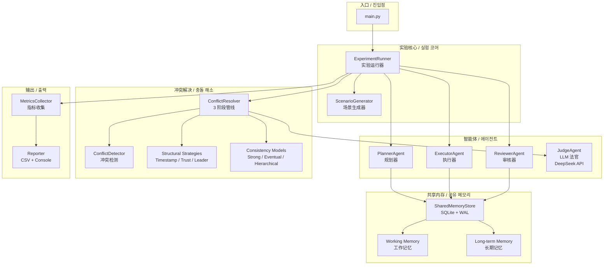
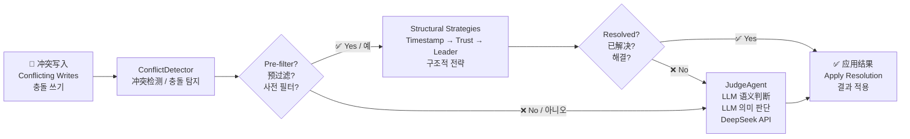
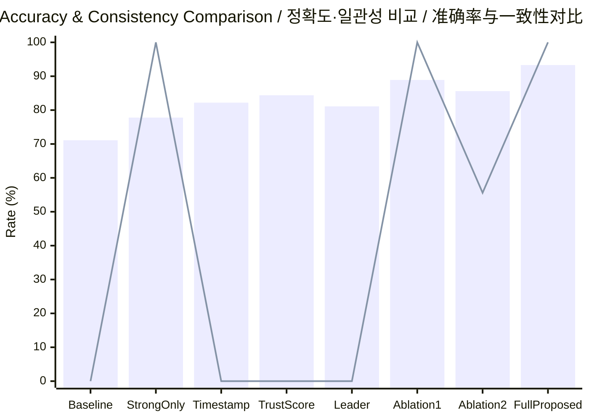

# Multi-Agent Shared Memory Experiment<br/>멀티 에이전트 공유 메모리 실험<br/>多智能体共享内存实验

멀티 에이전트 공유 메모리 시스템에서의 계층형 일관성 모델 및 충돌 해소 메커니즘 설계 — 프로토타입 구현 및 실험 코드

多智能体共享内存系统中的分层一致性模型与冲突解决机制设计 — 原型实现与实验代码

---

## 개요 / 概述 / Overview

본 저장소는 석사논문 *"멀티 에이전트 공유 메모리 시스템에서의 계층형 일관성 모델 및 충돌 해소 메커니즘 설계"* 의 프로토타입 구현과 실험 코드를 포함합니다.

本仓库包含硕士学位论文《多智能体共享内存系统中的分层一致性模型与冲突解决机制设计》的原型实现与实验代码。

3개 역할 기반 에이전트(Planner, Executor, Reviewer)가 공유 메모리에 접근할 때 발생하는 **가시성 충돌**, **순서성 충돌**, **의미적 충돌**을 탐지·해소하는 8가지 비교군을 3가지 시나리오에서 평가합니다.

评估 3 种角色智能体（Planner、Executor、Reviewer）在访问共享内存时产生的**可见性冲突**、**顺序性冲突**和**语义冲突**的 8 种对比配置，覆盖 3 种冲突场景。

---

## 아키텍처 / 架构 / Architecture



### 모듈 구조 / 模块结构 / Module Structure

```
prototype/
├── main.py              # 진입점 / 入口点 / Entry point
├── config.py            # 실험 파라미터 / 实验参数 / Experiment parameters
├── agents/              # 에이전트 구현 / 智能体实现
│   ├── base.py          # BaseAgent (읽기/쓰기/신뢰도 추적)
│   ├── roles.py         # Planner, Executor, Reviewer
│   └── judge.py         # LLM 기반 Judge Agent (DeepSeek API)
├── memory/              # 공유 메모리 저장소 / 共享内存存储
│   ├── models.py        # 데이터 모델 (MemoryEntry, ConflictRecord 등)
│   └── store.py         # SQLite 기반 SharedMemoryStore
├── conflict/            # 충돌 탐지 및 해소 / 冲突检测与解决
│   ├── detector.py      # 구조적 충돌 탐지 / 结构性冲突检测
│   └── resolver.py      # 3단계 해소 파이프라인 / 三阶段解决管线
├── consistency/         # 일관성 모델 / 一致性模型
│   ├── strong.py        # 잠금 기반 강한 일관성 / 基于锁的强一致性
│   ├── eventual.py      # 비차단 최종 일관성 / 非阻塞最终一致性
│   └── hierarchical.py  # 2계층 일관성 / 双层分层一致性
├── strategies/          # 해소 전략 / 解决策略
│   ├── timestamp.py     # 타임스탬프 우선 / 时间戳优先
│   ├── trust_score.py   # 신뢰도 우선 / 信任分数优先
│   └── leader.py        # 리더 에이전트 중재 / 领导智能体仲裁
└── experiments/         # 실험 프레임워크 / 实验框架
    ├── runner.py        # 메인 실험 루프 / 主实验循环
    ├── groups.py        # 8개 비교군 설정 / 8 组对比配置
    ├── scenarios.py     # 3개 충돌 시나리오 / 3 种冲突场景
    ├── metrics.py       # 메트릭 수집 / 指标收集
    └── reporter.py      # 콘솔 + CSV 출력 / 控制台 + CSV 输出
```

---

## 충돌 해소 파이프라인 / 冲突解决管线 / Resolution Pipeline



---

## 실험 설계 / 实验设计 / Experiment Design

```mermaid
graph LR
    subgraph Groups["8 个对比组 / 8개 비교군"]
        G1["1. Baseline<br/>基线 / 베이스라인"]
        G2["2. StrongOnly<br/>仅强一致性"]
        G3["3. Timestamp<br/>时间戳优先"]
        G4["4. TrustScore<br/>信任分数优先"]
        G5["5. Leader<br/>领导仲裁"]
        G6["6. Ablation1<br/>无 Judge"]
        G7["7. Ablation2<br/>无预过滤"]
        G8["8. FullProposed<br/>完整方案"]
    end

    subgraph Scenarios["3 个场景 / 3개 시나리오"]
        S1["Simultaneous Write<br/>同时写入 / 동시 쓰기"]
        S2["Ordering Conflict<br/>顺序冲突 / 순서 충돌"]
        S3["Semantic Conflict<br/>语义冲突 / 의미 충돌"]
    end

    subgraph Iterations["30 次迭代 / 30회 반복"]
        I1["Iter 1..30"]
    end

    Groups --> Scenarios --> Iterations
```



### 8 Comparison Groups / 8개 비교군 / 8 个对比组

| Group | 탐지<br/>检测 | 전략<br/>策略 | Judge<br/>Agent | Pre-filter<br/>预过滤 | 일관성<br/>一致性 |
|-------|:---:|:---:|:---:|:---:|--------------|
| 1. Baseline | ✗ | ✗ | ✗ | ✗ | none |
| 2. StrongOnly | ✓ | ✗ | ✗ | ✗ | strong |
| 3. TimestampPriority | ✓ | timestamp | ✗ | ✓ | none |
| 4. TrustScorePriority | ✓ | trust score | ✗ | ✓ | none |
| 5. LeaderMediation | ✓ | leader | ✗ | ✓ | none |
| 6. Ablation1 (NoJudge) | ✓ | all structural | ✗ | ✓ | hierarchical |
| 7. Ablation2 (NoPreFilter) | ✓ | all structural | ✓ | ✗ | hierarchical |
| 8. **FullProposed** | ✓ | all structural | ✓ | ✓ | hierarchical |

### 3 Conflict Scenarios / 3개 충돌 시나리오 / 3 种冲突场景

| 시나리오 / 场景 | 설명 / 描述 |
|---|---|
| **Simultaneous Write**<br/>동시 쓰기 / 同时写入 | 두 에이전트가 50ms 이내에 동일 키에 쓰기<br/>两个智能体在 50ms 窗口内写入同一键 |
| **Ordering Conflict**<br/>순서 충돌 / 顺序冲突 | 오래된 버전의 에이전트가 새 값을 덮어씀<br/>持有旧版本的智能体覆盖新值 |
| **Semantic Conflict**<br/>의미 충돌 / 语义冲突 | 두 에이전트가 상반된 자연어 결론 생성 (15개 고정 쌍)<br/>两个智能体产生矛盾的自然语言结论（15 组固定对） |

### Metrics / 메트릭 / 评估指标

| 지표 / 指标 | 설명 / 描述 |
|---|---|
| **Accuracy** / 정확도 / 准确率 | 올바르게 해결된 충돌 비율 / 正确解决的冲突比例 |
| **Memory Consistency Rate** / 일관성 유지율 / 内存一致性率 | 일관성 위반 없이 유지된 비율 |
| **Task Success Rate** / 과제 성공률 / 任务成功率 | 유효한 결과값이 생성된 비율 |
| **Average Latency** / 평균 지연시간 / 平均延迟 | 충돌 해소까지 소요 시간 (ms) |

---

## 실행 방법 / 运行方法 / How to Run

### Requirements / 필요 조건 / 环境要求

```bash
pip install -r prototype/requirements.txt
```

- Python 3.12+
- openai >= 1.0.0
- numpy >= 1.24.0

### Configuration / 설정 / 配置

DeepSeek API 키를 환경 변수로 설정:

设置 DeepSeek API 密钥为环境变量：

```bash
# Windows (PowerShell)
$env:DEEPSEEK_API_KEY = "your-api-key"

# Linux / macOS
export DEEPSEEK_API_KEY="your-api-key"
```

또는 `prototype/config.py`의 `API_KEY = None`을 직접 키 문자열로 교체할 수 있습니다 (커밋하지 마세요).

或直接将 `prototype/config.py` 中的 `API_KEY = None` 替换为密钥字符串（请勿提交）。

기타 설정(`AGENT_COUNT`, `ITERATIONS`, `RANDOM_SEED` 등)은 `prototype/config.py`에서 변경 가능합니다.

其他设置（`AGENT_COUNT`、`ITERATIONS`、`RANDOM_SEED` 等）可在 `prototype/config.py` 中修改。

### Run / 실행 / 运行

```bash
python -m prototype.main
```

실행 결과:
- 콘솔에 8개 비교군 × 3개 시나리오의 정확도, 일관성 유지율, 지연시간 출력
- `prototype/` 디렉토리에 CSV 파일 2종(상세 결과 + 피벗) 자동 저장

运行结果：
- 控制台输出 8 个对比组 × 3 种场景的准确率、一致性保持率、延迟
- 在 `prototype/` 目录自动保存 2 种 CSV 文件（详细结果 + 数据透视表）

---

## 주요 결과 / 主要结果 / Key Results

| Group | Accuracy / 정확도 | Consistency / 일관성 | Avg Latency / 지연시간 |
|-------|:---:|:---:|:---:|
| 1. Baseline | 71.1% | 0.0% | 4.4ms |
| 8. **FullProposed** | **93.3%** | **100.0%** | 478.7ms |



> **핵심 발견 / 关键发现:**
> FullProposed는 Baseline 대비 정확도 **22.2%p** 향상, 100% 메모리 일관성 유지.
> Judge Agent 그룹은 의미적 충돌에서 **80.0%** 정확도 달성.
> 구조적 사전 필터링으로 LLM 호출 3× 감소(30 vs 90), 지연시간 3.1× 단축.
>
> 完整方案相比基线准确率提升 **22.2%p**，保持 100% 内存一致性。
> Judge Agent 组在语义冲突中达到 **80.0%** 准确率。
> 结构化预过滤将 LLM 调用减少 3 倍（30 vs 90），延迟降低 3.1 倍。

---

## License / 라이선스 / 许可证

MIT
